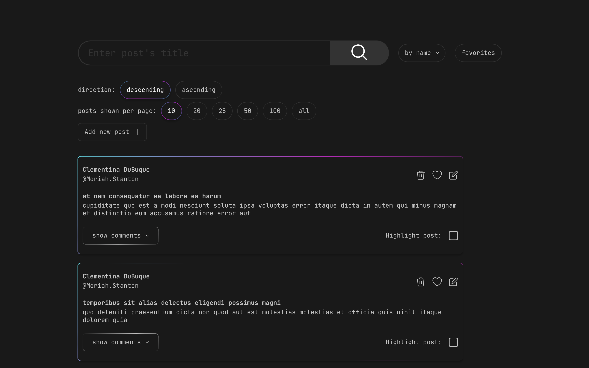

<div align="center">
  <br>
  
  <h1>JSON-Placeholder app</h1>
</div>

JSON-Placeholder - небольшое приложение, которое позволяет просматривать, редактировать, удалять, существующие посты, добавлять новые, а также осуществлять сортировку и фильтрацию всего списка. Разработано на базе [{JSON} Placeholder API](https://jsonplaceholder.typicode.com).

Статус: в процессе разработки

* Ссылка на дизайн в Figma: [здесь](https://www.figma.com/file/w1UrmSlLvzPcaPy0t9xzPm/Json-placeholder-task?type=design&node-id=2517%3A2047&mode=design&t=dgwQ1kFc0PGzaFMl-1);
* Ссылка на деплой: https://github.com/theverybusybee/JSON-placeholder-app

## Используемый стек технологий
* [React](https://react.dev) в качестве основной платформы разработки,
* [TypeScript](https://www.typescriptlang.org) для внедрения типизации,
* [Redux-Toolkit](https://redux-toolkit.js.org) в связке с [Immer](https://immerjs.github.io/immer/) для осуществления стейт-менеджмента,
* [Vite](https://vitejs.dev) для сборки,
* [ESLint](https://eslint.org) + [Prettier](https://prettier.io) для поддержки стандартизированного форматирования,
* [Husky](https://typicode.github.io/husky/) +  [Commitizen](https://commitizen-tools.github.io/commitizen/) для унификации коммитов,
* [Clsx](https://www.npmjs.com/package/clsx) для упрощения работы с классами,

##  Как запустить приложение локально

1. Клонируем репозиторий и переходим в него

```bash
# по https
https://github.com/theverybusybee/JSON-placeholder-app.git

# или по ssh
git@github.com:theverybusybee/JSON-placeholder-app.git

cd JSON-placeholder-app
```

2. Устанавливаем зависимости

```bash
npm i
```

3. Запускаем приложение

```bash
npm run dev
```

## Осталось добавить:
* Экранирование для форм;
* Дизайн адаптива и сам адаптив;
* Дизайн страницы NotFound;
* Loader;
* Расширенную пагинацию для больших значений;
* Тесты для приложения.

Более подробно о текущих задачах описано на [канбан-доске в Notion](https://theverybusybee.notion.site/JSON-Placeholder-9d8fe40e7dfd4a99b9010ef761a8fa7a?pvs=4);

